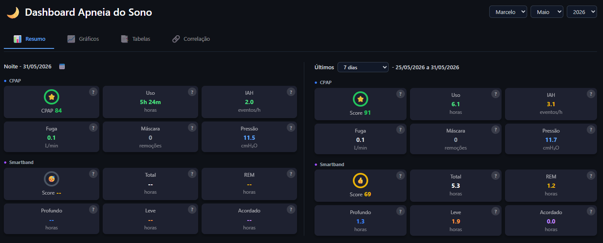
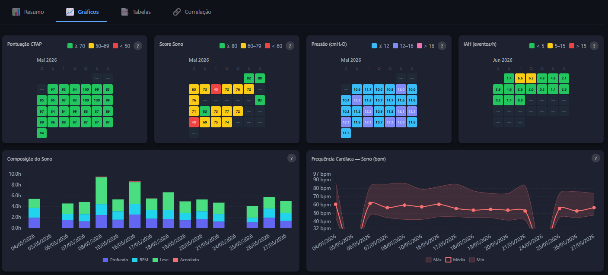
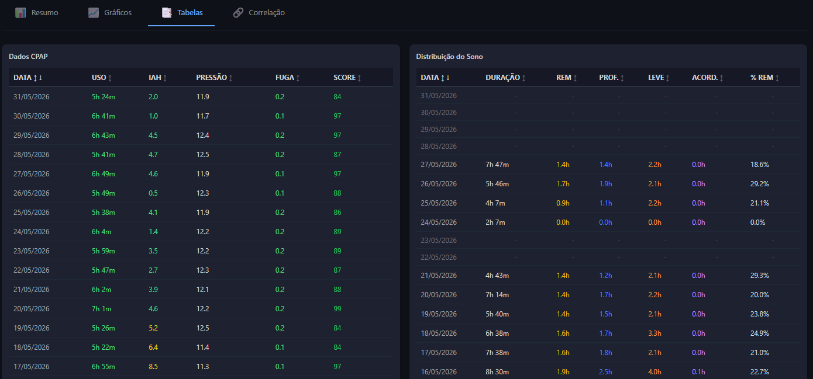
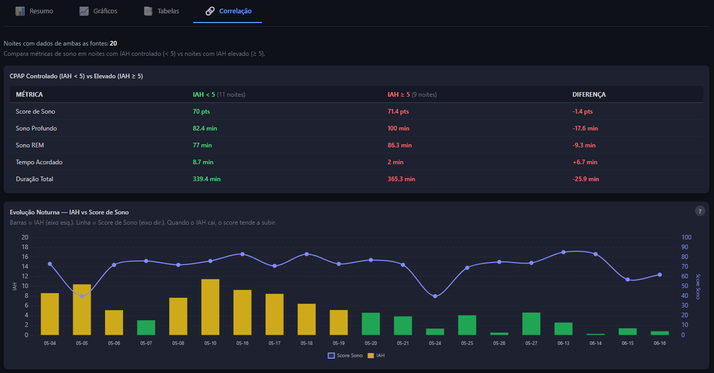

# Dashboard Apneia do Sono 🌙

[](https://python.org)
[](https://fastapi.tiangolo.com)
[](LICENSE)

Dashboard clínico integrado para monitoramento de **Apneia do Sono**, combinando dados de terapia CPAP (ResMed AirSense) com dados de sono e atividade da **Smartband Xiaomi Mi Fitness**.

---

## 📸 Screenshots

### Resumo Noturno


### Gráficos Mensais


### Tabelas de Dados


### Correlação CPAP × Sono


---

## ✨ Funcionalidades

- 📊 **Resumo Noturno** — score CPAP, IAH, fuga, pressão e dados de sono da Smartband para qualquer noite selecionada
- 📅 **Calendário interativo** em português — filtra toda a tela pela data escolhida
- 📈 **Gráficos mensais** — visualiza score, IAH, pressão e score de sono do mês completo
- 🔢 **Médias do período** — 7 ou 30 dias anteriores à data selecionada
- 📑 **Tabelas detalhadas** — histórico completo com ordenação por coluna
- ℹ️ **Tooltips explicativos** — clique no `?` para entender cada métrica
- 👤 **Multi-paciente** — selecione entre diferentes pacientes

---

## 🏗️ Arquitetura

```
cpap_smartband/
├── data/                          # Dados brutos e processados (não versionados)
│   ├── cpap_sd/<paciente>/        # Cartão SD do CPAP ResMed
│   ├── Smartband/                 # CSVs exportados do Mi Fitness
│   └── processed/                 # Parquet gerados pelos pipelines
│       ├── summary/               # Dados CPAP por paciente
│       ├── smartband_sleep/       # Sono bruto Smartband
│       ├── smartband_sleep_daily/ # Sono agregado diário
│       ├── smartband_vitals/      # FC e SpO2 contínuos
│       └── smartband_activity/    # Passos e calorias diários
├── src/
│   ├── ingestion/                 # Pipelines de processamento
│   │   ├── processor.py           # Processamento CPAP (EDF → Parquet)
│   │   └── smartband_processor.py # Processamento Smartband (CSV → Parquet)
│   └── visualization/             # Servidor FastAPI + Frontend
│       ├── app.py                 # Entry point FastAPI
│       ├── routers/api.py         # Endpoints REST
│       ├── services/              # Lógica de scoring e carregamento
│       └── static/index.html      # Frontend (HTML + Chart.js + Flatpickr)
├── scripts/
│   └── generate_demo.py           # Gera dados demo sintéticos
├── docs/                          # Documentação técnica
├── requirements.txt
├── start.ps1 / start.bat          # Scripts de inicialização
└── update_data.ps1                # Atualiza dados processados
```

---

## 🚀 Instalação e Uso

### Pré-requisitos

- Python **3.12+**
- Dados do CPAP: cartão SD do ResMed AirSense copiado para `data/cpap_sd/<paciente>/`
- Dados da Smartband: CSVs exportados do app Mi Fitness em `data/Smartband/`

> **Não tem dados reais?** Use os dados de demonstração sintéticos — veja abaixo.

### 1. Clonar o repositório

```bash
git clone https://github.com/marcelogbastos/cpap-smartband.git
cd cpap_smartband
```

### 2. Criar ambiente virtual e instalar dependências

```bash
python -m venv venv

# Windows
venv\Scripts\activate

# Linux/macOS
source venv/bin/activate

pip install -r requirements.txt
```

### 3. Processar os dados

```powershell
# Windows (PowerShell) — CPAP + Smartband (incremental)
.\update_data.ps1

# Reset completo (reprocessa tudo do zero)
.\update_data.ps1 -Reset

# Especificar paciente
.\update_data.ps1 -Patient marcelo
```

### 4. Iniciar o dashboard

```powershell
# Windows
.\start.ps1
# ou
.\start.bat
```

```bash
# Linux/macOS (ativar venv primeiro)
uvicorn src.visualization.app:app --reload --port 8000
```

Acesse: **http://127.0.0.1:8000**

---

## 🎮 Demo com Dados Sintéticos

Para testar o dashboard sem dados reais:

```bash
# Gera dados sintéticos para um paciente de demonstração
python scripts/generate_demo.py
```

Depois inicie o servidor normalmente. O paciente **"demo"** estará disponível no seletor.

---

## 📡 API REST

| Endpoint | Descrição |
|---|---|
| `GET /api/patients` | Lista pacientes disponíveis |
| `GET /api/data/{patient}` | Dados CPAP completos (timeseries + KPIs) |
| `GET /api/smartband/{patient}/daily` | Dados diários da Smartband |
| `GET /api/smartband/{patient}/monthly-sleep` | Sono mensal da Smartband |
| `GET /api/cpap/{patient}/monthly` | Dados CPAP mensais |

Documentação interativa disponível em: **http://127.0.0.1:8000/docs**

---

## 📊 Métricas Monitoradas

### CPAP (ResMed AirSense)
| Métrica | Descrição | Referência |
|---|---|---|
| **Score myAir** | Pontuação geral da sessão | 0-100 (≥70 = Excelente) |
| **IAH** | Índice de Apneia-Hipopneia | <5 = Normal |
| **Fuga P95** | Vazamento de ar (percentil 95) | ≤24 L/min |
| **Pressão P95** | Pressão aplicada (percentil 95) | cmH₂O |
| **Uso da Máscara** | Tempo de uso contínuo | ≥4h recomendado |
| **Eventos de Máscara** | Remoções durante a noite | — |

### Smartband (Xiaomi Mi Fitness)
| Métrica | Descrição |
|---|---|
| **Score do Sono** | Avaliação geral da qualidade do sono |
| **Duração Total** | Tempo total dormindo |
| **Sono REM** | Fase de recuperação mental |
| **Sono Profundo** | Fase de recuperação física |
| **Sono Leve** | Fase de transição |
| **Tempo Acordado** | Interrupções durante a noite |

---

## 🔒 Privacidade e Dados

Os dados médicos do paciente **nunca são versionados** no repositório. O `.gitignore` exclui:

- `data/cpap_sd/` — dados brutos do CPAP
- `data/Smartband/` — CSVs da Smartband
- `data/processed/` — dados processados em Parquet

Apenas o código-fonte e os scripts são publicados.

---

## 🛠️ Tecnologias

| Camada | Tecnologia |
|---|---|
| Backend | Python 3.12, FastAPI, Uvicorn |
| Processamento | Pandas, PyArrow, MNE (EDF), PyEDFlib |
| Frontend | HTML5, Vanilla JS, Tailwind CSS |
| Gráficos | Chart.js |
| Calendário | Flatpickr (pt-BR) |
| Dados | Apache Parquet |

---

## 📄 Licença

MIT License — veja [LICENSE](LICENSE) para detalhes.

---

## 👤 Autor

## ⚙️ Como executar (rápido)

Encontrará instruções detalhadas de execução com e sem Docker em: `docs/documentacao_tecnica.md` (seção "12. Como Executar (Docker / Sem Docker)").

Em resumo:

- Docker: `docker-compose up --build` (recomendado)
- Local: criar venv, `pip install -r requirements.txt`, rodar `python src/ingestion/processor.py` e `uvicorn src.visualization.app:app --reload`


Desenvolvido para uso pessoal e clínico no monitoramento de terapia CPAP integrado com wearables.
